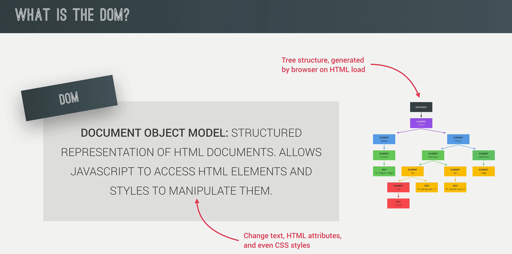
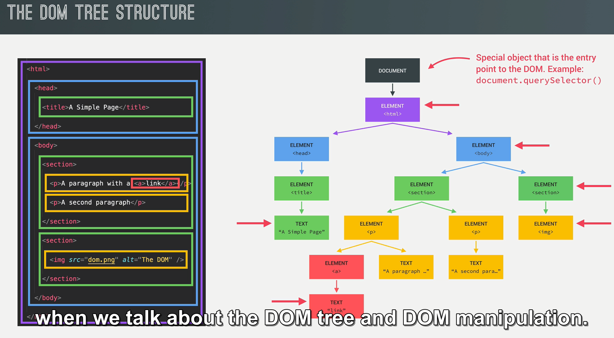

# Lecture 3 Project#1 Guess my Number



```js
console.log(document.querySelector('.message').textContent);
```

# Document: querySelector() method

The [`Document`](https://developer.mozilla.org/en-US/docs/Web/API/Document) method **`querySelector()`** returns the first [`Element`](https://developer.mozilla.org/en-US/docs/Web/API/Element) within the document that matches the specified [CSS selector](https://developer.mozilla.org/en-US/docs/Web/CSS/CSS_selectors), or group of CSS selectors. If no matches are found, `null` is returned.




